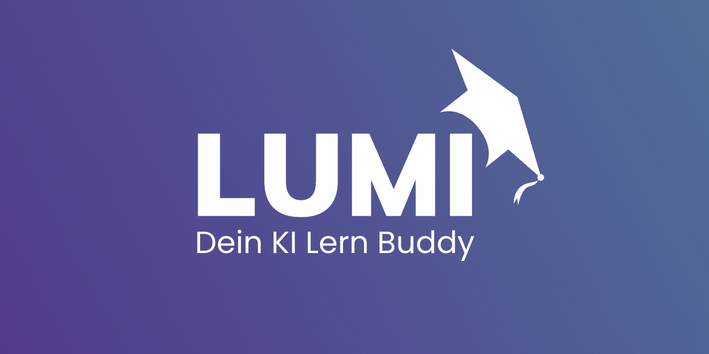
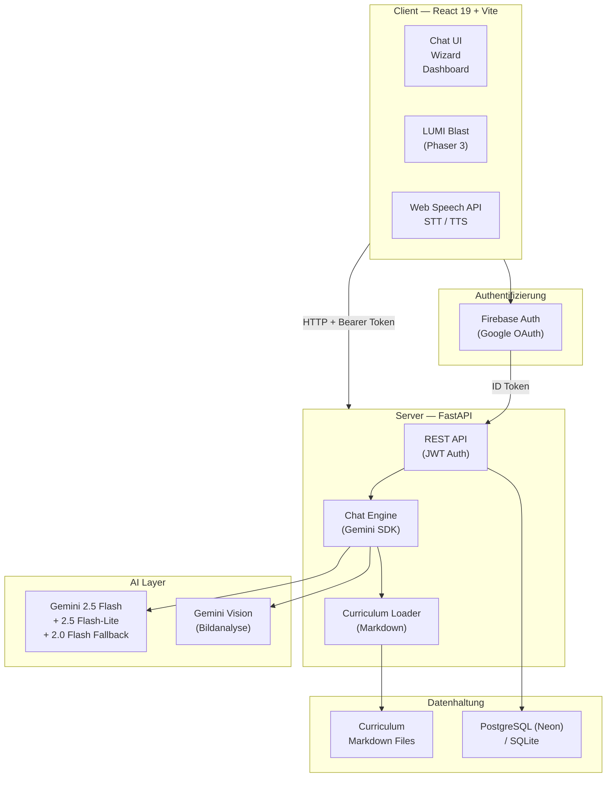
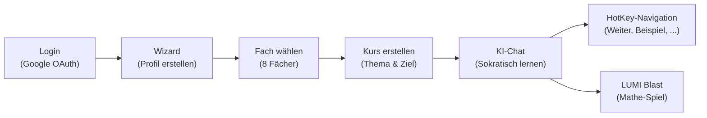
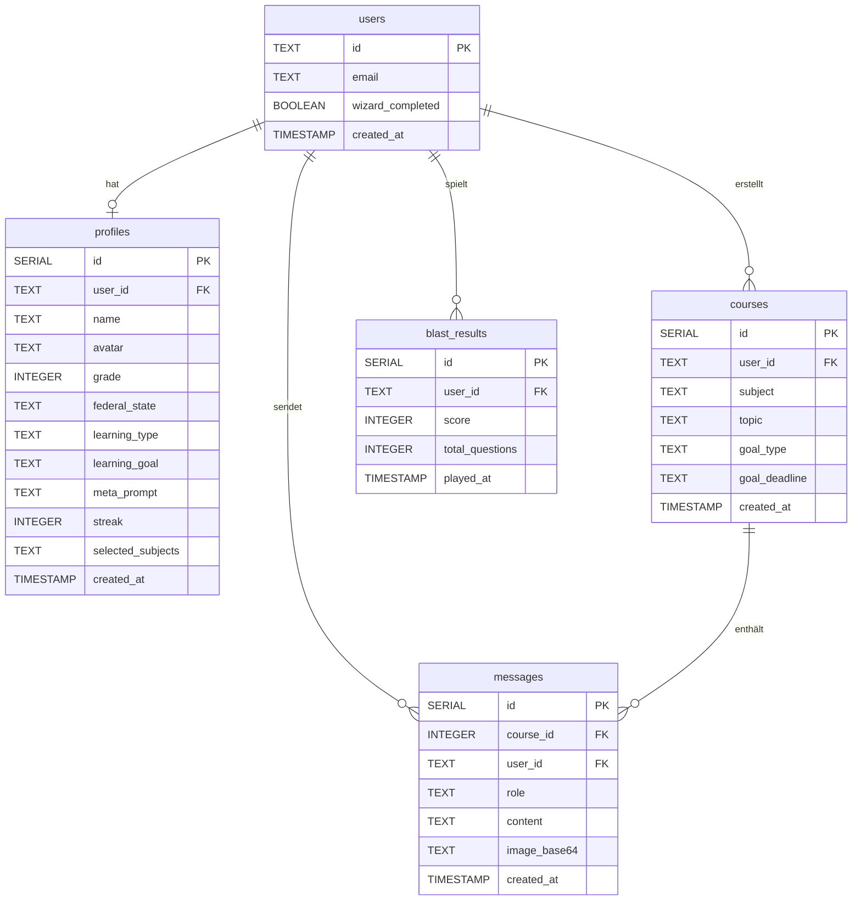

<p align="center">
  
</p>

<h1 align="center">LUMI</h1>

<p align="center">
  <strong>Dein KI Lern Buddy &mdash; Intelligentes Tutoring für die Grundschule</strong>
</p>

<p align="center">
  
  
  
  
  
  
  
  
</p>

---

<p align="center">
LUMI ist eine KI-gestützte Nachhilfeplattform für Grundschüler der Klassen 1&ndash;4. Powered by Google Gemini, nutzt LUMI die <strong>Sokratische Methode</strong> und einen <strong>3-Schritte-Lernpfad</strong>, um Kinder individuell durch 8 Schulfächer zu begleiten &mdash; mit Gamification, Sprach-Interaktion und lehrplanbasiertem Wissen.
</p>

---

## Features

<table>
  <tr>
    <td align="center" width="25%">
      <h3>KI-Tutor</h3>
      <p>Sokratische Methode mit 3-Schritte-Lernpfad (Grundlagen, Vertiefung, Übung). LUMI gibt nie direkte Antworten, sondern führt durch gezielte Rückfragen zum Ziel.</p>
    </td>
    <td align="center" width="25%">
      <h3>Hausaufgaben-Scanner</h3>
      <p>Foto hochladen und Gemini Vision analysiert das Arbeitsblatt automatisch. Anschließend geführte Hilfe statt Lösungen.</p>
    </td>
    <td align="center" width="25%">
      <h3>LUMI Blast</h3>
      <p>Phaser 3 Arcade-Mathe-Spiel mit klassenangepasster Schwierigkeit. Addition, Subtraktion, Multiplikation &amp; Division als Spielspaß.</p>
    </td>
    <td align="center" width="25%">
      <h3>Personalisierungs-Wizard</h3>
      <p>7-Schritte-Onboarding: Avatar, Name, Klasse, Bundesland, Lerntyp, Lernziel &amp; Fächerauswahl für maßgeschneidertes Lernen.</p>
    </td>
  </tr>
  <tr>
    <td align="center" width="25%">
      <h3>Lehrplan-Integration</h3>
      <p>Curriculum-Kontext pro Fach &amp; Klassenstufe als Knowledge Base. Unterstützung für alle 16 Bundesländer.</p>
    </td>
    <td align="center" width="25%">
      <h3>Sprach-Ein/Ausgabe</h3>
      <p>Speech-to-Text &amp; Text-to-Speech via Web Speech API. Deutsche Sprachmodelle für natürliche Interaktion.</p>
    </td>
    <td align="center" width="25%">
      <h3>HotKey-Navigation</h3>
      <p>One-Tap Buttons für junge Lerner: Weiter, Vereinfachen, Beispiel, Noch ein Beispiel &amp; Neues Thema.</p>
    </td>
    <td align="center" width="25%">
      <h3>8 Schulfächer</h3>
      <p>Mathe, Deutsch, Englisch, Sachunterricht, Kunst, Musik, Sport &amp; Religion/Ethik &mdash; mit individuellen Lehrplänen.</p>
    </td>
  </tr>
</table>

---

## Architektur



---

## Tech Stack

| Layer | Technologie | Zweck |
|-------|-------------|-------|
| **Frontend** | React 19 + TypeScript 5.9 | SPA mit Komponentenarchitektur |
| **Bundler** | Vite 7 | Schnelle Entwicklung & HMR |
| **Styling** | Tailwind CSS 4 | Utility-first CSS, kindgerechtes Design |
| **Auth** | Firebase Auth (Google OAuth) | Sichere Authentifizierung |
| **Game** | Phaser 3.90 | Arcade-Mathe-Spiel (LUMI Blast) |
| **Markdown** | react-markdown 10 | Rendering von KI-Antworten |
| **Routing** | React Router 7 | Client-Side Routing |
| **Backend** | FastAPI (Python) | REST API & Chat Engine |
| **KI** | Google GenAI SDK (Gemini 2.0 Flash) | Tutoring & Vision |
| **Datenbank** | PostgreSQL (Neon) / SQLite | Persistente Datenhaltung |
| **Deployment** | Render.com | Frontend Static + Backend Service |

---

<!-- ## Screenshots

> TODO: Screenshots hinzufügen
>
> Empfohlene Screenshots:
> - Landing Page
> - Chat-Ansicht mit HotKey-Buttons
> - Personalisierungs-Wizard
> - LUMI Blast Spiel
> - Fächerauswahl

-->

## Erste Schritte

### Voraussetzungen

- Python 3.12+
- Node.js 20.x+
- Firebase Projekt (Google Auth aktiviert)
- Google Gemini API Key

### Setup

```bash
git clone https://github.com/<dein-user>/lumi-learning-platform.git
cd lumi-learning-platform

# .env Dateien aus Vorlagen erstellen
cp frontend/.env.example frontend/.env
cp backend/.env.example backend/.env
```

### Umgebungsvariablen

**Frontend** (`frontend/.env`):

| Variable | Beschreibung |
|----------|-------------|
| `VITE_FIREBASE_API_KEY` | Firebase API Key |
| `VITE_FIREBASE_AUTH_DOMAIN` | Firebase Auth Domain |
| `VITE_FIREBASE_PROJECT_ID` | Firebase Project ID |
| `VITE_FIREBASE_STORAGE_BUCKET` | Firebase Storage Bucket |
| `VITE_FIREBASE_MESSAGING_SENDER_ID` | Firebase Messaging Sender ID |
| `VITE_FIREBASE_APP_ID` | Firebase App ID |
| `VITE_API_URL` | Backend URL (lokal: `http://127.0.0.1:8000`) |

**Backend** (`backend/.env`):

| Variable | Beschreibung | Pflicht |
|----------|-------------|---------|
| `GEMINI_API_KEY` | Google Gemini API Key | Ja |
| `JWT_SECRET` | JWT Secret (`openssl rand -hex 32`) | Ja |
| `DATABASE_URL` | PostgreSQL Connection String (Neon) | Nein |
| `CORS_ORIGINS` | Zusätzliche erlaubte Origins (kommagetrennt) | Nein |
| `FIREBASE_SERVICE_ACCOUNT_JSON` | Firebase Service Account als JSON-String | Nein* |

> \* Alternativ kann eine `serviceAccountKey.json` im `backend/` Verzeichnis abgelegt werden.

### Backend starten

```bash
cd backend
pip install -r requirements.txt
uvicorn main:app --reload
# Server läuft auf http://localhost:8000
```

### Frontend starten

```bash
cd frontend
npm install
npm run dev
# App läuft auf http://localhost:5173
```

---

<details>
<summary><strong>Projektstruktur</strong></summary>

```
lumi-learning-platform/
├── frontend/
│   ├── public/
│   │   └── logo.png
│   ├── src/
│   │   ├── App.tsx
│   │   ├── main.tsx
│   │   ├── components/
│   │   │   ├── BlastGame/
│   │   │   │   ├── BlastGame.tsx
│   │   │   │   ├── math_tasks.ts
│   │   │   │   └── phaser/
│   │   │   │       ├── createBlastGame.ts
│   │   │   │       ├── types.ts
│   │   │   │       └── scenes/
│   │   │   │           └── PlayScene.ts
│   │   │   ├── CourseCreationModal.tsx
│   │   │   ├── HotKeyButtons.tsx
│   │   │   ├── LoadingScreen.tsx
│   │   │   ├── ProtectedRoute.tsx
│   │   │   ├── StepTimeline.tsx
│   │   │   └── SubjectSelectionModal.tsx
│   │   ├── hooks/
│   │   │   └── useAuth.ts
│   │   ├── pages/
│   │   │   ├── AppPage.tsx
│   │   │   ├── BlastPage.tsx
│   │   │   ├── ChatPage.tsx
│   │   │   ├── LandingPage.tsx
│   │   │   ├── LoginPage.tsx
│   │   │   ├── SubjectChatPage.tsx
│   │   │   └── WizardPage.tsx
│   │   └── services/
│   │       ├── api.ts
│   │       └── firebase.ts
│   ├── .env.example
│   ├── package.json
│   ├── tailwind.config.ts
│   ├── tsconfig.json
│   └── vite.config.ts
│
├── backend/
│   ├── main.py
│   ├── requirements.txt
│   ├── .env.example
│   ├── knowledge/
│   │   ├── mathe/
│   │   │   ├── klasse_1.md ... klasse_4.md
│   │   ├── deutsch/
│   │   │   ├── klasse_1.md ... klasse_4.md
│   │   ├── englisch/
│   │   │   ├── klasse_3.md, klasse_4.md
│   │   ├── sachunterricht/
│   │   │   ├── klasse_1.md ... klasse_4.md
│   │   ├── kunst/
│   │   ├── musik/
│   │   ├── sport/
│   │   └── religion_ethik/
│   └── prompts/
│       └── system_prompt.txt
│
└── README.md
```

</details>

<details>
<summary><strong>API-Referenz</strong></summary>

### Profil

| Method | Endpoint | Beschreibung |
|--------|----------|-------------|
| `GET` | `/api/profile` | Benutzerprofil abrufen |
| `POST` | `/api/profile/wizard` | Wizard-Daten speichern |
| `PUT` | `/api/profile/subjects` | Ausgewählte Fächer aktualisieren |

### Fächer

| Method | Endpoint | Beschreibung |
|--------|----------|-------------|
| `GET` | `/api/subjects/all` | Alle verfügbaren Fächer |
| `GET` | `/api/subjects` | Fächer des Nutzers |

### Kurse

| Method | Endpoint | Beschreibung |
|--------|----------|-------------|
| `POST` | `/api/courses` | Neuen Kurs erstellen |
| `GET` | `/api/courses` | Kurse des Nutzers auflisten |
| `GET` | `/api/courses/{id}/messages` | Nachrichtenverlauf eines Kurses |

### Chat

| Method | Endpoint | Beschreibung |
|--------|----------|-------------|
| `POST` | `/api/chat` | Nachricht senden (Text + optionales Bild) |
| `POST` | `/api/chat/hotkey` | HotKey-Aktion auslösen |

### Gaming

| Method | Endpoint | Beschreibung |
|--------|----------|-------------|
| `POST` | `/api/blast/results` | LUMI Blast Spielergebnis speichern |

### Sonstiges

| Method | Endpoint | Beschreibung |
|--------|----------|-------------|
| `GET` | `/` | Health Check |
| `GET` | `/api/greeting` | Begrüßung (Name, Avatar, Streak) |

> Alle `/api/*` Endpunkte erfordern einen `Authorization: Bearer <firebase-id-token>` Header.

</details>

---

## So funktioniert's



---

## Datenbank-Schema



---

## KI-Architektur

### Gemini Fallback-Chain

LUMI nutzt eine robuste Fallback-Strategie mit drei Gemini-Modellen. Falls ein Modell nicht verfügbar ist (z.B. durch Quota-Limits), wird automatisch das nächste Modell in der Kette verwendet:

```
gemini-2.5-flash → gemini-2.5-flash-lite → gemini-2.0-flash
```

### Meta-Prompt System

Aus den Wizard-Daten (Name, Klasse, Bundesland, Lerntyp, Lernziel) wird ein **Meta-Prompt** generiert, der bei jeder KI-Anfrage mitgesendet wird. So passt LUMI Sprache, Schwierigkeit und Beispiele perfekt auf den individuellen Schüler an.

### Curriculum-Knowledge Injection

Statt RAG (Retrieval-Augmented Generation) lädt LUMI den relevanten Lehrplan-Kontext direkt aus Markdown-Dateien in den System-Prompt:

```
backend/knowledge/{fach}/klasse_{stufe}.md → System-Prompt
```

Dies ermöglicht lehrplangetreue Antworten ohne den Overhead einer Vektordatenbank.

---

## Deployment

### Render.com

| Service | Typ | Details |
|---------|-----|---------|
| **Frontend** | Static Site | Build: `npm run build`, Publish: `dist/` |
| **Backend** | Web Service | Start: `uvicorn main:app --host 0.0.0.0 --port $PORT` |
| **Datenbank** | PostgreSQL (Neon) | Verbindung über `DATABASE_URL` |

### Deploy-Checkliste

- [ ] `frontend/.env` mit Produktions-URLs konfiguriert
- [ ] `backend/.env` mit `GEMINI_API_KEY` und `JWT_SECRET` gesetzt
- [ ] `DATABASE_URL` auf Neon PostgreSQL zeigt
- [ ] `CORS_ORIGINS` enthält die Frontend-Domain
- [ ] Firebase Auth mit Produktions-Domain konfiguriert

---

## Contributing

Beiträge sind willkommen! So geht's:

```bash
# 1. Fork erstellen
# 2. Feature Branch anlegen
git checkout -b feat/mein-feature

# 3. Änderungen committen (Conventional Commits)
git commit -m "feat: beschreibung des features"

# 4. Branch pushen
git push origin feat/mein-feature

# 5. Pull Request erstellen
```

**Commit-Format:** `<type>: <beschreibung>`
Typen: `feat`, `fix`, `refactor`, `docs`, `test`, `chore`, `perf`, `ci`

---

<p align="center">
  <sub>Universitätsprojekt &mdash; Entwickelt mit Leidenschaft für besseres Lernen</sub>
</p>
