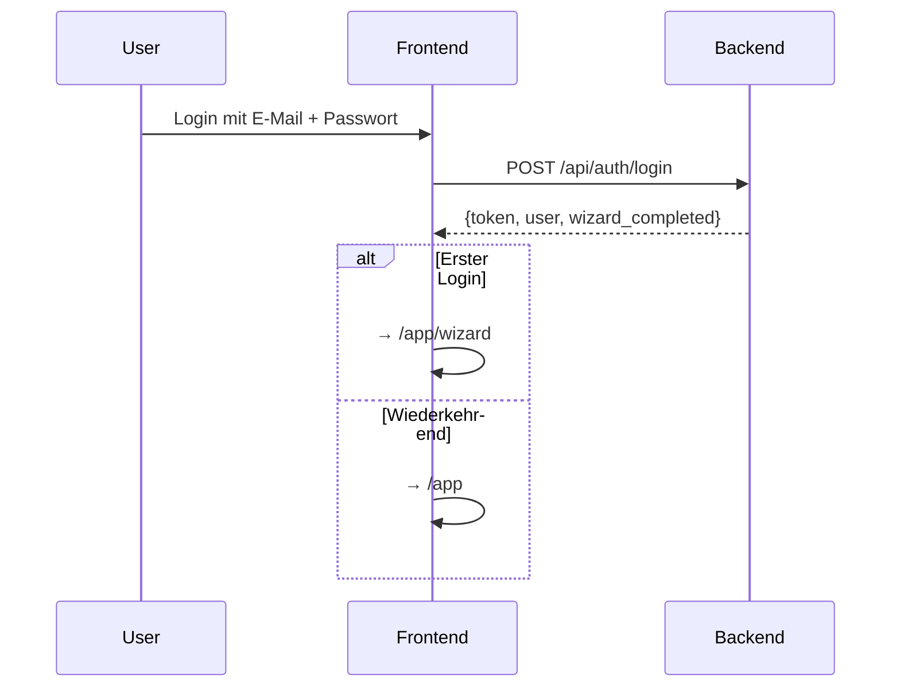

# Projekt 1 – LUMI Homepage & Landing Page

## 1. Projektziel

Die LUMI-Homepage ist der Einstiegspunkt fuer Schueler, Eltern und Lehrkraefte: **Landingpage** mit Login-Button, danach Weiterleitung in die App.

**Kernfunktionen:**

- Landingpage mit Vorstellung der Plattform
- Login-Button → nach Login Weiterleitung auf `/app`
- **Onboarding-Wizard** beim ersten Login: Name, Lerntyp, Klassenstufe erfassen
- Dashboard mit persoenlicher Begruessung + Faecher-Bubbles (Wassertropfen-Design)

---

## 2. Tech-Stack (vereinfacht fuer Pitch)

| Komponente       | Technologie           | Warum                                    |
| ---------------- | --------------------- | ---------------------------------------- |
| **Frontend**     | React (Vite)          | Schneller Build, Komponenten-basiert      |
| **Styling**      | TailwindCSS           | Schnelle Iteration, sieht sofort gut aus  |
| **Backend**      | FastAPI (Python)       | Minimaler Code, automatische API-Docs     |
| **LLM**          | Google Gemini 2.5 Flash | Kostenlos (Free Tier), Vision + Text    |
| **Datenbank**    | SQLite                | Eine Datei, kein Setup noetig             |
| **Hosting**      | Lokal (Pitch) / GitHub Pages + Azure Student (spaeter) | Kostenlos |

> **Bewusst weggelassen fuer den Pitch:** Docker, CI/CD, PostgreSQL, OAuth, Token-Refresh. Das sind Skalierungs-Themen, keine Pitch-Themen.

---

## 3. Seitenstruktur

```
/                    → Landingpage (oeffentlich)
/login               → Login-Formular (oeffentlich)
/app                 → Dashboard: Begruessung + Faecher-Bubbles (geschuetzt)
/app/wizard          → Onboarding-Wizard (nur beim ersten Login)
/app/kurs/:id/chat   → KI-Chat innerhalb eines Kurses
/app/blast           → Blast Game (nur Mathe)
```

### 3.1 Landingpage (`/`)

- **Hero-Section:** Claim + CTA-Button ("Jetzt starten")
- **Features:** 3–4 Icons (Socratic Tutoring, Bilderkennung, Gamification, Spracheingabe)
- **So funktioniert's:** 3-Schritt-Erklaerung
- **Footer:** Impressum, Datenschutz

### 3.2 Login (`/login`)

- E-Mail + Passwort Formular
- Fuer den Pitch: **Demo-Accounts** vorbereiten (z. B. `lena@demo.de` / `1234`)
- Nach Login → Wizard (erster Login) oder Dashboard

### 3.3 Onboarding-Wizard (`/app/wizard`)

- Einmalig nach dem ersten Login
- Erfasst: Name, Klassenstufe, Lerntyp, Lernziel + **Avatar-Auswahl** (Tier)
- Avatar-Auswahl: Schueler waehlt ein Tier als Profilbild (Fuchs, Eule, Panda, Delfin, Katze, Hund, Schildkroete, Pinguin, ...)
- Generiert daraus einen **Meta-Prompt**, der bei jeder KI-Anfrage mitgesendet wird
- Details siehe [Projekt 2, Abschnitt 4](./02-ki-chat.md#4-onboarding-wizard)

### 3.4 App-Dashboard (`/app`)

**Layout:**

```
┌─────────────────────────────────────────────┐
│  🦊 Hallo Lena! 🌟                         │
│  "Mathe ist wie Kochen – man braucht       │
│   die richtigen Zutaten! 🧑‍🍳"              │
│  🔥 Streak: 5 Tage                         │
├─────────────────────────────────────────────┤
│                                             │
│   💧 Mathe    💧 Deutsch    💧 Englisch     │
│   🚀 Blast!                                │
│                                             │
└─────────────────────────────────────────────┘
```

- **Begruessung oben:** Tier-Avatar + "Hallo [Name]" + taeglich wechselnder Fun-Spruch + Streak
- **Faecher-Bubbles darunter:** Wassertropfen-Design, farbcodiert, klickbar
- Klick auf Bubble → oeffnet Kurs-Uebersicht fuer dieses Fach
- Mathe-Bubble hat zusaetzlich Blast-Game-Icon

---

## 4. Auth (vereinfacht fuer Pitch)



- **Pitch-Vereinfachung:** Einfacher JWT-Token, kein Refresh, kein OAuth
- Demo-Accounts im Backend vorbereiten
- Token wird im `localStorage` gespeichert, bei jeder API-Anfrage als Header mitgesendet

---

## 5. UI/UX-Konzept

### Design-Prinzipien

- **Kindgerecht aber professionell:** Verspielt, Tier-Avatare, aber nicht albern
- **Typografie:** Sans-Serif Font (z. B. Nunito, Quicksand), **grosse Schrift**, gut lesbar
- **Viele Tiere:** Tier-Avatare als Profilbilder, Tier-Illustrationen auf der Landingpage
- **Wenig Text, viel visuell:** Bubbles, Emojis, Farben, kurze Saetze
- **Mobile-First:** Responsive fuer Tablet (Schul-iPads) und Desktop

### Tier-Avatare

Schueler waehlen im Wizard ein Tier als Avatar. Das Avatar erscheint im Header, im Chat und auf dem Dashboard.

| Tier         | Emoji | Farbe   |
| ------------ | ----- | ------- |
| Fuchs        | 🦊    | Orange  |
| Eule         | 🦉    | Braun   |
| Panda        | 🐼    | Schwarz |
| Delfin       | 🐬    | Blau    |
| Katze        | 🐱    | Gelb    |
| Schildkroete | 🐢    | Gruen   |
| Pinguin      | 🐧    | Dunkel  |
| Hase         | 🐰    | Rosa    |

> Spaeter: Eigene Tier-Illustrationen statt Emojis (SVG oder Lottie-Animationen).

### Farbpalette

| Farbe          | Hex       | Verwendung               |
| -------------- | --------- | ------------------------- |
| Primary Blue   | `#4F46E5` | Buttons, Links             |
| Secondary Mint | `#10B981` | Erfolg, Fortschritt        |
| Warm Orange    | `#F59E0B` | Gamification, XP           |
| Neutral Gray   | `#F3F4F6` | Hintergruende              |
| Dark Text      | `#1F2937` | Fliesstext                 |

---

## 6. Projektstruktur

```
uni-lumi-ki-lernplattform/
├── frontend/
│   ├── src/
│   │   ├── components/        # UI-Bausteine (Header, Bubbles, Chat, Wizard, BlastGame)
│   │   ├── pages/             # LandingPage, LoginPage, AppPage, ChatPage, BlastPage
│   │   ├── hooks/useAuth.ts   # Auth-State
│   │   ├── services/api.ts    # API-Calls
│   │   └── App.tsx            # Routing
│   ├── package.json
│   └── vite.config.ts
│
├── backend/
│   ├── main.py                # FastAPI App (alles in einer Datei fuer Pitch)
│   ├── knowledge/             # Lehrplan-Kontext als .md Dateien
│   ├── prompts/               # System-Prompt + Lueckentext-Template
│   └── requirements.txt
│
└── README.md
```

> **Fuer den Pitch:** Backend kann als **eine einzige `main.py`** starten. Kein komplexes Router/Service/Model-System noetig. Das reicht zum Vorzeigen.

---

## 7. Lokal starten

```bash
# Terminal 1: Backend
cd backend
pip install -r requirements.txt
uvicorn main:app --reload

# Terminal 2: Frontend
cd frontend
npm install
npm run dev
```

| Service    | URL                         |
| ---------- | --------------------------- |
| Frontend   | http://localhost:5173        |
| Backend    | http://localhost:8000        |
| API-Docs   | http://localhost:8000/docs   |

---

## 8. Naechste Schritte

1. **Projekt 2:** KI-Chat bauen → [docs/02-ki-chat.md](./02-ki-chat.md)
2. **Landingpage:** Hero + Features + Login-Formular
3. **Wizard:** 3–4 Schritte, Profil speichern
4. **Dashboard:** Begruessung + Bubbles
5. **Spaeter:** GitHub Pages + Azure Deployment
