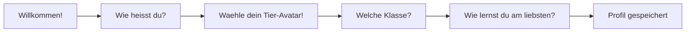
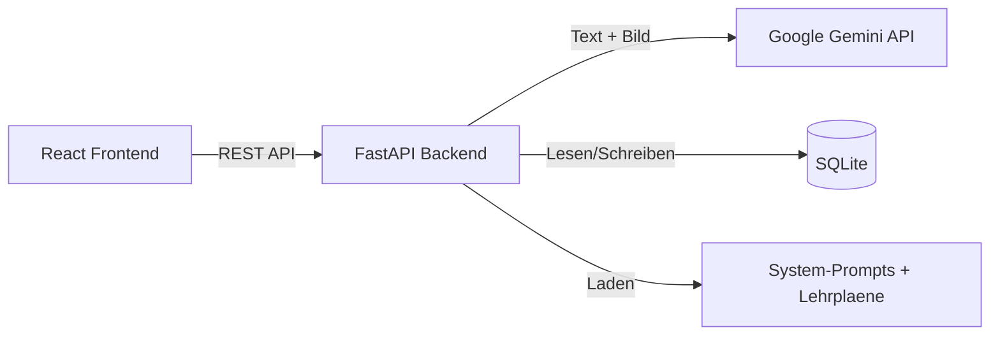
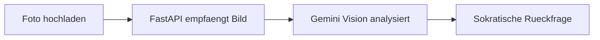

# Projekt 2 – KI-Chat mit Bilderkennung & Socratic Tutoring

## 1. Projektziel

Das Herzstueck der LUMI-Plattform: ein **KI-Chat**, der Schuelern (Klassen 1–4) beim Lernen hilft. Kein RAG, sondern **Gemini Vision** fuer Bilderkennung + **Lehrplan-Kontext als System-Prompt**.

**Kernfunktionen:**

- **Onboarding-Wizard** → personalisierter Meta-Prompt
- **Kurs-basierte Chats** – jeder Chat gehoert zu einem Fach + Thema
- **Socratic Tutoring** – Antworten in Schritte unterteilt, KI fragt zurueck
- **Bilderkennung** – Fotos von Arbeitsblaettern hochladen
- **HotKey-Buttons** – "Verstanden", "Nicht verstanden", "Zeig Beispiel"
- **Streak-System** – Tage am Stueck gelernt
- **Blast Game** – Mathe-Shooter mit einfachen Rechenaufgaben
- **Taegliche Begruessung** – "Hallo [Name]" + Fun-Spruch
- **Spracheingabe + Vorlesen** - Kinderrfreundlich
- **Auf dem Ipdad Browser wird das chat fensret als karo papier dargestellt** - somit kann ein nutzer mit apple pencil handschriftlich mathe und text ren zeichnen und apple wandelt es selbrr in ascii text um
- **Open Source Übenungsaufgaben** - Aus dem Ministerien frei verfügbare geürüfe aufgaben für jede jahrgangsstufe


---

## 2. Warum kein RAG?

| Aspekt              | RAG                              | LUMI-Ansatz                           |
| ------------------- | -------------------------------- | ------------------------------------- |
| **Arbeitsblaetter** | PDF → Chunks → Embeddings → DB  | Foto → Gemini Vision erkennt direkt    |
| **Fachwissen**      | Vector DB pflegen                | Lehrplan als System-Prompt hinterlegen |
| **Komplexitaet**    | Hoch                             | Niedrig (ein API-Call)                 |

> Schueler laden einzelne Fotos hoch und wollen sofort damit arbeiten. RAG ist dafuer zu aufwaendig.

---

## 3. Tech-Stack (vereinfacht fuer Pitch)

| Was                  | Technologie              | Warum                                |
| -------------------- | ------------------------ | ------------------------------------ |
| **Backend**          | FastAPI (Python)         | Minimaler Code, automatische Docs     |
| **LLM + Vision**     | Google Gemini 2.5 Flash  | Kostenlos (Free Tier), Text + Bild    |
| **Frontend**         | React (Vite) + Tailwind  | Schnell, sieht gut aus                |
| **Blast Game**       | HTML5 Canvas             | Nativ im Browser, kein Framework      |
| **STT / TTS**        | Web Speech API (Browser) | Kostenlos, kein Server noetig         |
| **Datenbank**        | SQLite                   | Eine Datei, kein Setup                |

> **Bewusst weggelassen:** Docker, ChromaDB, LangChain, PostgreSQL, CI/CD, komplexe Microservices. Alles laeuft in **einer `main.py`** im Backend.

### Warum Gemini statt OpenAI?

| Kriterium       | Gemini 2.5 Flash  | OpenAI GPT-4o     |
| --------------- | ------------------ | ------------------ |
| **Free Tier**   | 15 RPM kostenlos   | Kein Free Tier     |
| **Vision**      | Ja                 | Ja                 |
| **Kosten**      | ~$0.10 / 1M Tokens | ~$2.50 / 1M Tokens |

> Gemini ist **25x guenstiger** und hat ein Free Tier. Perfekt fuer ein Student-Projekt. Fallback: Azure OpenAI mit Student Credits ($100).

---

## 4. Onboarding-Wizard

Beim **ersten Login** wird der Schueler durch einen kurzen Wizard gefuehrt:



| Feld              | Optionen                                         | Effekt im Chat                     |
| ----------------- | ------------------------------------------------ | ---------------------------------- |
| **Name**          | Freitext                                          | KI spricht Schueler mit Namen an    |
| **Avatar**        | Tier waehlen (Fuchs, Eule, Panda, Delfin, etc.)  | Profilbild im Header + Dashboard    |
| **Klassenstufe**  | 5–10                                              | Schwierigkeitsgrad anpassen         |
| **Lerntyp**       | Visuell, Auditiv, Haptisch, Lesen/Schreiben      | KI passt Erklaerungsstil an         |
| **Lernziel**      | Noten verbessern, Pruefung, Neugier               | KI priorisiert Uebungen/Erklaerungen |

**Generierter Meta-Prompt (Beispiel):**

```
Der Schueler heisst Lena, Klasse 7.
Lerntyp: visuell → nutze Diagramme und bildhafte Vergleiche.
Lernziel: Klassenarbeit vorbereiten.
Sprache: freundlich, ermutigend, altersgerecht.
```

Wird bei **jeder Chat-Nachricht** automatisch mitgesendet.

---

## 5. Systemarchitektur



**So einfach ist das.** Kein ChromaDB, kein LangChain, keine Microservices.

Das Backend macht im Kern drei Dinge:
1. **Prompt zusammenbauen:** System-Prompt + Lehrplan-Kontext + Meta-Prompt + User-Nachricht
2. **An Gemini senden:** Text und optional Bild
3. **Antwort zurueckgeben + speichern**

---

## 6. Bilderkennung



- **Formate:** JPEG, PNG (Handy-Kamera oder Screenshot)
- **Uebertragung:** Base64 im API-Request
- **Was wird erkannt:** Handschrift, gedruckter Text, Grafiken, Diagramme, Tabellen

**Beispiel:**

```
Schueler: [Laedt Foto von Mathe-Arbeitsblatt hoch]
          "Hilf mir bei Aufgabe 3"

LUMI:    "📸 Ich sehe eine Gleichung: 2x + 5 = 17

          🤔 **Schritt 1:** Was passiert, wenn du
          auf beiden Seiten die 5 abziehst?

          👇 Was denkst du?"

          [✅ Verstanden, weiter]  [❓ Nicht verstanden]
```

---

## 7. Kurs-Konzept & Chat-Einstieg

Jeder Chat gehoert zu einem **Kurs** (Fach + Thema). Beim Erstellen fuellt der Schueler den Lueckentext aus:

```
"Ich moechte fuer eine _______ lernen.
Im Fach _______ bis _______."
```

**Beispiel:**

```
"Ich moechte fuer eine Klassenarbeit lernen.
Im Fach Mathe bis naechste Woche Dienstag."
```

```
Fach: Mathe
├── Kurs: Bruchrechnung (2 Chat-Sessions)
├── Kurs: Gleichungen (1 Chat-Session)
└── 🚀 Blast Game
```

---

## 8. Socratic Tutoring – 3-Schritte-Methode & HotKeys

### Prinzip

Die KI gibt **nie direkt die Loesung**. Jede Antwort wird in **genau 3 sinnvolle Teilschritte** unterteilt:

| Schritt | Name            | Inhalt                                             |
| ------- | --------------- | -------------------------------------------------- |
| 1       | **Grundlagen**  | Was muss man wissen? Begriffe, Regeln, Grundidee   |
| 2       | **Vertiefung**  | Erklaerung mit Beispiel, Zusammenhaenge verstehen   |
| 3       | **Uebung**      | Eigene Aufgabe loesen, KI prueft und gibt Feedback  |

**Ablauf:**

1. Schueler stellt Frage
2. LUMI zeigt **nur Schritt 1** (Grundlagen) – kurz und knackig
3. Schueler entscheidet: "Verstanden" → Schritt 2 | "Nicht verstanden" → nochmal einfacher
4. Weiter bis Schritt 3 (Uebung)

> Der Schueler bestimmt das Tempo. Kein Informations-Overload.

### HotKey-Buttons

| Button                     | Was passiert                                    |
| -------------------------- | ----------------------------------------------- |
| ✅ "Verstanden, weiter"   | Naechster Schritt                                |
| ❓ "Nicht verstanden"     | Gleicher Schritt, einfacher erklaert             |
| 💡 "Zeig mir ein Beispiel"| Konkretes Rechen-/Textbeispiel                   |
| 📸 "Bild hochladen"       | Kamera / Datei-Upload                            |

Technisch: Buttons senden vorgefertigte Prompts (z. B. `"[HOTKEY:NEXT_STEP]"`, `"[HOTKEY:SIMPLIFY]"`).

---

## 9. Taegliche Begruessung & Streak

### Begruessung

Beim Oeffnen der App:

```
🌟 Hallo Lena! 🌟
"Wer lernt, hat morgen weniger Panik! 😄"
🔥 Streak: 5 Tage
```

Sprueche rotieren taeglich aus einer Liste im Backend.

### Streak

- **Zaehlt Tage am Stueck** mit mindestens 1 Chat-Nachricht oder 1 Blast-Runde
- Kein Login = Streak auf 0
- Meilensteine: 7, 14, 30 Tage → Bonus-XP

---

## 10. Blast Game (nur Mathe)

**Mathe-Shooter** mit einfachen Rechenaufgaben. Verfuegbar nur ueber die Mathe-Bubble.

**Spielmechanik:**

- Weltraum-Hintergrund, Raumschiff (Blaster) unten
- 4 Antwort-Bubbles schweben langsam durch den Raum
- Maus nach links/rechts → Blaster-Winkel kippen, Klick → schiessen
- **Richtig:** +10 Punkte, gruener Effekt
- **Falsch:** -5 Punkte, roter Effekt
- 10 Aufgaben pro Runde → Ergebnis-Screen

**Aufgaben (immer einfache Grundrechenarten):**

```
7 × 8 = ?     →  Bubbles: [54] [56✓] [48] [63]
45 - 28 = ?   →  Bubbles: [13] [23] [17✓] [27]
72 ÷ 9 = ?    →  Bubbles: [7] [8✓] [9] [6]
```

**Technik:** HTML5 Canvas, Aufgaben werden im Frontend lokal generiert (kein API-Call). Nur das Ergebnis (Punkte, XP) wird ans Backend geschickt.

---

## 11. Kindgerechter Output & System-Prompt

### Design-Sprache

- **Font:** Sans-Serif (Nunito / Quicksand) – rund, freundlich, gut lesbar
- **Schriftgroesse:** Gross (min. 18px Body, 24px+ Headlines)
- **Tier-Avatare** ueberall sichtbar (Header, Chat, Dashboard)
- **Verspielt aber professionell** – kein Baby-Design, sondern modern + warm

### Formatierungsregeln (LLM-Output)

- **Maximal 2–3 kurze Saetze pro Absatz** – wenig Text zum Lesen
- Emojis als visuelle Anker (📐 🤔 💡 ✅ 🎯)
- **Bold** fuer Schluesselbegriffe
- Immer nur **1 Schritt** auf einmal (nie alles auf einmal)
- Ermutigende, positive Sprache
- Rueckfrage am Ende jedes Schrittes

### Prompt-Template (Beispiel-Output)

So sieht ein typischer LUMI-Output aus:

```
📐 **Schritt 1: Grundlagen** 📐

Eine Gleichung ist wie eine Waage ⚖️

**Links** und **rechts** muss immer
das Gleiche stehen!

🤔 Was denkst du: Was passiert,
wenn du auf beiden Seiten 5 abziehst?

[✅ Verstanden, weiter]  [❓ Nicht verstanden]
```

```
🔍 **Schritt 2: Vertiefung** 🔍

Schauen wir uns ein Beispiel an:

**2x + 5 = 17**

Wenn wir −5 rechnen:
**2x = 12** ✨

Jetzt teilen wir durch 2...
was kommt raus? 🤔

[✅ Verstanden, weiter]  [❓ Nicht verstanden]
```

```
🎯 **Schritt 3: Uebung** 🎯

Jetzt bist du dran! 💪

Loese diese Gleichung:
**3x + 7 = 22**

Schreib mir deinen Loesungsweg! ✏️
```

### System-Prompt

```
Du bist LUMI, ein freundlicher Lerntutor fuer Schueler der Klassen 5–10.

REGELN:
1. Antworte NIEMALS direkt mit der Loesung.
2. Teile JEDE Erklaerung in genau 3 Schritte:
   - Schritt 1: GRUNDLAGEN (Begriffe, Regeln, Grundidee)
   - Schritt 2: VERTIEFUNG (Beispiel, Zusammenhaenge)
   - Schritt 3: UEBUNG (Eigene Aufgabe loesen)
3. Zeige nur EINEN Schritt auf einmal. Warte auf den Schueler.
4. Stelle am Ende JEDES Schritts eine Rueckfrage.
5. Halte dich KURZ: Max. 2–3 Saetze pro Absatz.
6. Nutze Emojis als visuelle Anker (📐 🔍 🎯 🤔 💡 ✅ ✨ 💪).
7. Nutze **Bold** fuer Schluesselbegriffe.
8. Sei ermutigend und positiv. Kein Notendruck.
9. Passe die Sprache an die Klassenstufe an.

HOTKEYS (wenn der Schueler diese sendet):
- [HOTKEY:NEXT_STEP] → Zeige den naechsten Schritt.
- [HOTKEY:SIMPLIFY] → Erklaere den gleichen Schritt einfacher.
- [HOTKEY:EXAMPLE] → Zeige ein konkretes Beispiel.

PAEDAGOGISCHER KONTEXT:
{lehrplan_kontext}

META-KONTEXT:
{meta_prompt_aus_wizard}

KURS-KONTEXT:
Fach: {fach}, Thema: {thema}
Lernziel: {lueckentext_prompt}
```

### Lehrplan-Kontext

Lehrplaene liegen als `.md`-Dateien im Backend und werden automatisch in den System-Prompt geladen:

```
backend/knowledge/
├── mathe/klasse_7.md
├── deutsch/klasse_7.md
└── englisch/klasse_7.md
```

---

## 12. Spracheingabe & Vorlesen (Phase 2)

Beide nutzen die **Web Speech API** (kostenlos, laeuft im Browser):

- **Spracheingabe:** Mikrofon-Button → Browser wandelt Sprache in Text → wird als Prompt gesendet
- **Vorlesen:** Lautsprecher-Icon → Text wird vorgelesen (Emojis und Markdown werden vorher entfernt)

---

## 13. Backend-Struktur (flach fuer Pitch)

```
backend/
├── main.py              # FastAPI App – ALLES in einer Datei
├── knowledge/           # Lehrplan .md Dateien
│   └── mathe/klasse_7.md
├── prompts/
│   └── system_prompt.txt
├── lumi.db              # SQLite (wird automatisch erstellt)
└── requirements.txt
```

**`requirements.txt`:**

```
fastapi
uvicorn
google-generativeai
python-multipart
pyjwt
passlib[bcrypt]
```

> **Fuer den Pitch:** Alles in `main.py`. Kein Router/Service/Model-Splitting noetig. Das Backend hat ca. 200–300 Zeilen Code. Aufteilen kann man spaeter.

---

## 14. API-Endpunkte (Uebersicht)

| Methode | Endpunkt              | Was                                       |
| ------- | --------------------- | ----------------------------------------- |
| POST    | `/api/auth/login`     | Login → Token                              |
| POST    | `/api/auth/register`  | Registrierung                              |
| POST    | `/api/profile/wizard` | Wizard-Daten speichern (inkl. Avatar)      |
| GET     | `/api/greeting`       | Begruessung + Streak                       |
| POST    | `/api/chat`           | Nachricht senden (Text + Bild) → KI-Antwort |
| POST    | `/api/chat/hotkey`    | HotKey-Aktion (NEXT_STEP, etc.)            |
| GET     | `/api/courses`        | Kurse auflisten                            |
| POST    | `/api/courses`        | Neuen Kurs erstellen                       |
| POST    | `/api/blast/result`   | Blast-Ergebnis speichern                   |

---

## 15. Datenschutz (DSGVO)

| Prinzip              | Umsetzung                                                 |
| -------------------- | ---------------------------------------------------------- |
| **Datensparsamkeit** | Bilder werden nicht dauerhaft gespeichert                    |
| **EU-Hosting**       | Azure West Europe / lokal fuer Pitch                        |
| **Pseudonymisierung**| Session-IDs statt Klarnamen in Chats                        |
| **Loeschkonzept**    | Automatisch nach 12 Monaten Inaktivitaet                    |
| **Rechtsgrundlage**  | Art. 6 Abs. 1 DSGVO (Einwilligung + Vertrag)               |
| **Minderjahrige**    | Einwilligung der Erziehungsberechtigten (Art. 8 DSGVO)      |

---

## 16. Hosting (spaeter, nach dem Pitch)

```
Frontend (GitHub Pages, kostenlos)  →  Backend (Azure App Service Free, Student Credits)  →  Gemini API (Free Tier)
```

- **GitHub Pages:** Statische React-SPA, HTTPS automatisch, Custom Domain moeglich
- **Azure App Service F1:** Kostenlos, 1 GB RAM, 60 min CPU/Tag – reicht fuer MVP
- **Gemini Free Tier:** 15 Requests/Minute kostenlos

---

## 17. Pitch-Prioritaeten

### Muss fuer den Pitch (Tag 1–3)

- [ ] Landingpage mit Login
- [ ] Wizard (Name, Klasse, Lerntyp)
- [ ] Dashboard mit Begruessung + Faecher-Bubbles
- [ ] Chat mit Gemini (Text + Bild-Upload)
- [ ] Socratic Tutoring (schrittweise Antworten + HotKeys)
- [ ] System-Prompt mit Lehrplan-Kontext

### Nice-to-have fuer den Pitch (Tag 4–5)

- [ ] Blast Game (Mathe-Shooter)
- [ ] Streak-System
- [ ] Taegliche Begruessung mit Fun-Spruch

### Spaeter (nach dem Pitch)

- Spracheingabe + Vorlesen
- Weitere Faecher
- Eltern-Dashboard
- GitHub Pages + Azure Deployment
- Gamification (XP, Level, Abzeichen)

---

## 18. Abgrenzung & USP

| Feature                       | LUMI                                | ChatGPT                    |
| ----------------------------- | ----------------------------------- | -------------------------- |
| Personalisierter Meta-Prompt  | Ja (Wizard)                          | Nein                        |
| Socratic Tutoring             | Ja (Schritte + HotKeys)             | Nein (direkte Antworten)    |
| Bilderkennung + Paedagogik    | Ja (Gemini Vision + Lehrplan)        | Vision ohne Schulkontext    |
| Kurs-basierte Chats           | Ja                                   | Nein (lose Chats)           |
| Kindgerechter Output          | Ja (Emojis, kurz, visuell)           | Nein (erwachsenenorientiert)|
| Streak + Blast Game           | Ja                                   | Nein                        |
| DSGVO fuer Schulen            | Ja (EU-Hosting)                      | Fraglich                    |
| Kosten MVP                    | $0                                   | API-Kosten ab Tag 1         |
