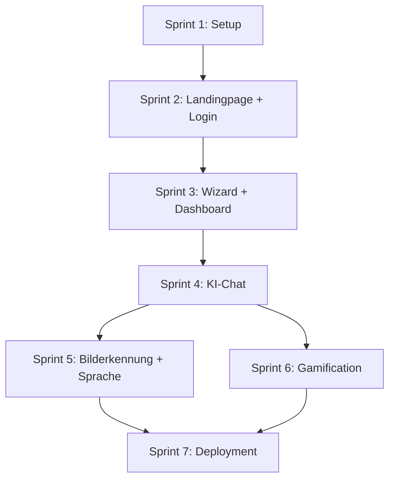

# LUMI – Umsetzungsplan (Sprint-by-Sprint)

> **Regel:** Sprint N+1 wird erst begonnen, wenn Sprint N vollstaendig abgeschlossen ist.
>
> **SSOT (Single Source of Truth):**
> - [docs/01-homepage-landing.md](./01-homepage-landing.md) – Homepage, Routing, Auth, UI/UX, Projektstruktur
> - [docs/02-ki-chat.md](./02-ki-chat.md) – KI-Chat, Wizard, Socratic Tutoring, Gamification, System-Prompt
>
> Alle technischen Entscheidungen, Designs und Endpunkte sind dort definiert. Dieses Dokument beschreibt **nur die Reihenfolge der Umsetzung**.

---

## Sprint 1: Projektsetup & Grundgeruest

**Ziel:** Repo steht, Frontend + Backend laufen lokal, Gemini API Key funktioniert.

| # | Aufgabe | Details | Referenz |
|---|---------|---------|----------|
| 1.1 | Git-Repo initialisieren | `git init`, `.gitignore` (node_modules, __pycache__, .env, lumi.db) | – |
| 1.2 | Frontend scaffolden | `npm create vite@latest frontend -- --template react-ts`, TailwindCSS installieren + konfigurieren | Doc 1 §2, §6 |
| 1.3 | Font einrichten | Nunito oder Quicksand (Google Fonts) als Standard-Font, grosse Schriftgroesse (18px+) | Doc 1 §5 |
| 1.4 | Backend scaffolden | `backend/main.py` mit FastAPI Hello World, `requirements.txt` anlegen | Doc 1 §6, Doc 2 §13 |
| 1.5 | Gemini API Key besorgen | Google AI Studio → API Key generieren → `.env` anlegen mit `GEMINI_API_KEY=...` | Doc 2 §3 |
| 1.6 | Gemini Test | In `main.py` einen Test-Endpoint `/api/test-gemini` bauen der einen simplen Prompt sendet und die Antwort zurueckgibt | Doc 2 §5 |
| 1.7 | CORS konfigurieren | `fastapi.middleware.cors` → `localhost:5173` erlauben | – |
| 1.8 | Lokal testen | Backend: `uvicorn main:app --reload` (Port 8000), Frontend: `npm run dev` (Port 5173), beide erreichbar | Doc 1 §7 |

**Ergebnis:** Zwei laufende Prozesse. Frontend zeigt eine leere React-App. Backend antwortet auf `/docs` und `/api/test-gemini`.

**Abnahmekriterien:**
- [ ] `npm run dev` startet ohne Fehler
- [ ] `uvicorn main:app --reload` startet ohne Fehler
- [ ] `/api/test-gemini` gibt eine Gemini-Antwort zurueck
- [ ] TailwindCSS + Nunito/Quicksand funktionieren im Frontend

---

## Sprint 2: Landingpage + Login + Routing

**Ziel:** Oeffentliche Landingpage steht, Login funktioniert mit Demo-Account, Routing zu `/app` nach Login.

| # | Aufgabe | Details | Referenz |
|---|---------|---------|----------|
| 2.1 | React Router einrichten | Routes: `/`, `/login`, `/app`, `/app/wizard`, `/app/kurs/:id/chat`, `/app/blast` | Doc 1 §3 |
| 2.2 | Landingpage bauen | Hero-Section (Claim + CTA), Features (4 Icons), "So funktioniert's" (3 Schritte), Footer | Doc 1 §3.1 |
| 2.3 | Tier-Illustrationen auf Landingpage | Freundliche Tier-Emojis/Grafiken in der Hero-Section und Features | Doc 1 §5 |
| 2.4 | Login-Seite bauen | E-Mail + Passwort Formular, Fehleranzeige | Doc 1 §3.2 |
| 2.5 | Backend: Auth-Endpoints | `POST /api/auth/login` und `POST /api/auth/register` – JWT-Token zurueckgeben | Doc 2 §14 |
| 2.6 | Backend: Demo-Accounts | Beim Start automatisch Demo-User anlegen (`lena@demo.de` / `1234`), SQLite-Tabelle `users` | Doc 1 §3.2 |
| 2.7 | Frontend: Auth-State | `useAuth` Hook: Token in localStorage, Auth-Header bei API-Calls, Protected Routes | Doc 1 §4 |
| 2.8 | Redirect-Logik | Nach Login: wenn `wizard_completed = false` → `/app/wizard`, sonst → `/app` | Doc 1 §4 |

**Ergebnis:** Man kann die Landingpage sehen, sich einloggen und wird zu `/app/wizard` oder `/app` weitergeleitet.

**Abnahmekriterien:**
- [ ] Landingpage rendert mit Hero, Features, Footer
- [ ] Login mit `lena@demo.de` / `1234` funktioniert
- [ ] JWT-Token wird gespeichert und bei API-Calls mitgesendet
- [ ] Redirect zu `/app/wizard` (erster Login) funktioniert
- [ ] Nicht-eingeloggte User werden von `/app` auf `/login` umgeleitet

---

## Sprint 3: Onboarding-Wizard + Dashboard

**Ziel:** Neuer User durchlaeuft Wizard (Name, Avatar, Klasse, Lerntyp), danach sieht er das Dashboard mit Begruessung und Faecher-Bubbles.

| # | Aufgabe | Details | Referenz |
|---|---------|---------|----------|
| 3.1 | Wizard UI bauen | Multi-Step-Form: (1) Name, (2) Tier-Avatar waehlen, (3) Klassenstufe, (4) Lerntyp + Lernziel | Doc 2 §4 |
| 3.2 | Tier-Avatar-Auswahl | Grid mit 8 Tieren (Fuchs, Eule, Panda, Delfin, Katze, Schildkroete, Pinguin, Hase), klickbar, selektiert | Doc 1 §5 (Tier-Avatare) |
| 3.3 | Backend: Wizard-Endpoint | `POST /api/profile/wizard` – speichert Name, Avatar, Klasse, Lerntyp, Lernziel in SQLite-Tabelle `profiles` | Doc 2 §14 |
| 3.4 | Meta-Prompt Generierung | Backend generiert aus Wizard-Daten einen Meta-Prompt-String und speichert ihn | Doc 2 §4 |
| 3.5 | Dashboard UI bauen | Begruessung oben (Avatar + "Hallo [Name]" + Fun-Spruch + Streak), Faecher-Bubbles darunter | Doc 1 §3.4 |
| 3.6 | Faecher-Bubbles | Wassertropfen-Design, farbcodiert (Mathe=blau, Deutsch=gruen, Englisch=rot), klickbar | Doc 1 §3.4 |
| 3.7 | Blast-Game-Icon | Mathe-Bubble bekommt ein zusaetzliches Raketen-Icon fuer das Blast Game | Doc 1 §3.4 |
| 3.8 | Backend: Greeting-Endpoint | `GET /api/greeting` – gibt Name, Avatar, Streak, taeglich wechselnden Spruch zurueck | Doc 2 §9, §14 |
| 3.9 | Fun-Spruch-Rotation | Liste von 30+ Spruechen im Backend, taeglich rotierend (basierend auf Tag des Jahres) | Doc 2 §9 |

**Ergebnis:** Nach Login durchlaeuft der User den Wizard, waehlt ein Tier-Avatar und sieht danach das Dashboard mit persoenlicher Begruessung und Faecher-Bubbles.

**Abnahmekriterien:**
- [ ] Wizard laeuft durch alle 4 Schritte
- [ ] Tier-Avatar-Auswahl funktioniert (8 Tiere sichtbar, eines selektierbar)
- [ ] Wizard-Daten werden im Backend gespeichert
- [ ] Dashboard zeigt Avatar + "Hallo [Name]" + Spruch + Streak
- [ ] Faecher-Bubbles sind sichtbar und klickbar
- [ ] Mathe-Bubble hat Blast-Game-Icon

---

## Sprint 4: KI-Chat (Kern)

**Ziel:** Voll funktionsfaehiger Chat mit Gemini, 3-Schritte-Methode, HotKey-Buttons und Kurs-Erstellung.

| # | Aufgabe | Details | Referenz |
|---|---------|---------|----------|
| 4.1 | Kurs-Erstellung | Beim Klick auf eine Fach-Bubble: Lueckentext-Prompt ausfuellen ("Ich moechte fuer eine ___ lernen. Im Fach ___ bis ___.") | Doc 2 §7 |
| 4.2 | Backend: Kurs-Endpoints | `GET /api/courses` (auflisten), `POST /api/courses` (erstellen) – SQLite-Tabelle `courses` | Doc 2 §14 |
| 4.3 | Chat UI bauen | Nachrichten-Verlauf (User vs. LUMI), Input-Feld unten, Senden-Button | Doc 2 §8 |
| 4.4 | HotKey-Buttons | Unter jeder LUMI-Antwort: ✅ Verstanden, ❓ Nicht verstanden, 💡 Beispiel, 📸 Bild | Doc 2 §8 |
| 4.5 | System-Prompt aufbauen | `prompts/system_prompt.txt` anlegen mit 3-Schritte-Regeln, Hotkey-Anweisungen, Platzhaltern | Doc 2 §11 |
| 4.6 | Lehrplan-Kontext laden | `knowledge/` Ordner mit mind. einer `.md`-Datei (z. B. `mathe/klasse_7.md`), wird beim Chat in den Prompt geladen | Doc 2 §11 |
| 4.7 | Backend: Chat-Endpoint | `POST /api/chat` – baut System-Prompt zusammen (Prompt + Lehrplan + Meta-Prompt + Kurs-Kontext + User-Nachricht), sendet an Gemini, speichert Nachricht + Antwort | Doc 2 §5, §14 |
| 4.8 | Backend: HotKey-Endpoint | `POST /api/chat/hotkey` – empfaengt Hotkey-Typ, sendet vorgefertigten Prompt an Gemini im Kontext des laufenden Chats | Doc 2 §8, §14 |
| 4.9 | Chat-Verlauf speichern | SQLite-Tabelle `messages` (user_id, course_id, role, content, timestamp) – wird bei jedem neuen Chat geladen | Doc 2 §5 |
| 4.10 | Kindgerechter Output rendern | Markdown-Rendering im Frontend (Bold, Emojis, kurze Absaetze) – z. B. mit `react-markdown` | Doc 2 §11 |

**Ergebnis:** User kann einen Kurs erstellen, im Chat Fragen stellen und bekommt schrittweise Antworten im 3-Schritte-Format. HotKey-Buttons funktionieren.

**Abnahmekriterien:**
- [ ] Kurs-Erstellung mit Lueckentext funktioniert
- [ ] Chat sendet Nachricht an Gemini und zeigt Antwort
- [ ] System-Prompt enthaelt 3-Schritte-Regeln
- [ ] LUMI antwortet mit Schritt 1 (Grundlagen) zuerst
- [ ] "Verstanden" → Schritt 2, "Nicht verstanden" → einfachere Erklaerung
- [ ] Chat-Verlauf wird gespeichert und beim Oeffnen geladen
- [ ] Output rendert Emojis, Bold, Absaetze korrekt

---

## Sprint 5: Bilderkennung + Spracheingabe

**Ziel:** User kann Fotos von Arbeitsblaettern hochladen und per Sprache Prompts eingeben.

| # | Aufgabe | Details | Referenz |
|---|---------|---------|----------|
| 5.1 | Bild-Upload UI | 📸-Button im Chat oeffnet Datei-Auswahl (Kamera auf Mobil), Vorschau vor dem Senden | Doc 2 §6 |
| 5.2 | Backend: Bild-Verarbeitung | Bild als Base64 empfangen, zusammen mit Text an Gemini Vision senden | Doc 2 §6 |
| 5.3 | Gemini Vision Integration | `google-generativeai` Python-SDK: `model.generate_content([prompt, image])` | Doc 2 §6 |
| 5.4 | Bilderkennungs-Prompt | Spezieller Prompt fuer Bilder: "Analysiere das Arbeitsblatt/die Grafik und hilf dem Schueler mit sokratischen Fragen." | Doc 2 §6 |
| 5.5 | Spracheingabe (STT) | Mikrofon-Button → Web Speech API `SpeechRecognition` → erkannter Text wird als Prompt gesendet | Doc 2 §12 |
| 5.6 | Vorlesen (TTS) | Lautsprecher-Icon neben LUMI-Antworten → Web Speech API `speechSynthesis` → Emojis/Markdown vorher entfernen | Doc 2 §12 |

**Ergebnis:** User kann ein Foto hochladen und LUMI analysiert es. Spracheingabe und Vorlesen funktionieren im Browser.

**Abnahmekriterien:**
- [ ] Bild-Upload oeffnet Datei-Auswahl
- [ ] Hochgeladenes Bild wird an Gemini Vision gesendet
- [ ] LUMI erkennt Handschrift/Text/Grafiken auf dem Foto
- [ ] Mikrofon-Button startet Spracherkennung (Chrome/Edge)
- [ ] Lautsprecher-Button liest Antwort vor (ohne Emojis)

---

## Sprint 6: Gamification (Streak + Blast Game)

**Ziel:** Streak-Zaehler funktioniert, Blast Game ist spielbar.

| # | Aufgabe | Details | Referenz |
|---|---------|---------|----------|
| 6.1 | Streak-Logik Backend | Bei jeder Chat-Nachricht oder Blast-Runde: `last_active_date` pruefen. Gleicher Tag = nichts tun. Gestern = Streak +1. Aelter = Streak auf 1 zuruecksetzen. | Doc 2 §9 |
| 6.2 | Streak im Dashboard anzeigen | 🔥-Emoji + Zahl, z. B. "🔥 5 Tage" | Doc 2 §9 |
| 6.3 | Blast Game UI | HTML5 Canvas: Weltraum-Hintergrund, Raumschiff unten, 4 Antwort-Bubbles schweben | Doc 2 §10 |
| 6.4 | Blast Game Mechanik | Maus links/rechts = Winkel kippen, Klick = schiessen. Richtig = +10 (gruen), Falsch = -5 (rot). 10 Aufgaben pro Runde. | Doc 2 §10 |
| 6.5 | Aufgaben-Generierung | Frontend generiert lokal einfache Grundrechenarten (+, −, ×, ÷). 4 Antwort-Optionen (1 richtig, 3 falsch). | Doc 2 §10 |
| 6.6 | Ergebnis-Screen | Nach 10 Aufgaben: Punkte, "Nochmal?" Button | Doc 2 §10 |
| 6.7 | Backend: Ergebnis speichern | `POST /api/blast/result` – Punkte + XP speichern, Streak aktualisieren | Doc 2 §14 |

**Ergebnis:** Streak wird korrekt gezaehlt und angezeigt. Blast Game ist spielbar mit 10 Aufgaben pro Runde.

**Abnahmekriterien:**
- [ ] Streak zaehlt korrekt hoch bei taeglicher Nutzung
- [ ] Streak zeigt 0 nach einem ausgelassenen Tag
- [ ] Blast Game startet ueber die Mathe-Bubble
- [ ] 4 Bubbles schweben, Raumschiff ist steuerbar
- [ ] Punkte werden korrekt berechnet (+10 / -5)
- [ ] Ergebnis wird ans Backend gesendet

---

## Sprint 7: Deployment (GitHub Pages + Azure)

**Ziel:** Frontend ist oeffentlich erreichbar, Backend laeuft auf Azure.

| # | Aufgabe | Details | Referenz |
|---|---------|---------|----------|
| 7.1 | Frontend Build | `npm run build` → `dist/` Ordner entsteht | – |
| 7.2 | GitHub Pages einrichten | Repo auf GitHub pushen, GitHub Pages aktivieren (Source: `gh-pages` Branch oder GitHub Actions) | Doc 2 §16 |
| 7.3 | Frontend Deploy-Script | `vite.config.ts` → `base: '/uni-lumi-ki-lernplattform/'` setzen, oder Custom Domain | – |
| 7.4 | API-URL konfigurieren | Frontend: Environment Variable `VITE_API_URL` → zeigt auf Azure Backend URL statt localhost | – |
| 7.5 | Azure App Service erstellen | Azure Portal → App Service (F1 Free Tier) → Python 3.11 → Region West Europe | Doc 2 §16 |
| 7.6 | Backend auf Azure deployen | GitHub Actions oder `az webapp up` → `main.py` deployen, `requirements.txt` wird automatisch installiert | Doc 2 §16 |
| 7.7 | Azure Environment Variables | `GEMINI_API_KEY`, `JWT_SECRET`, `CORS_ORIGINS` (GitHub Pages URL) im Azure Portal setzen | – |
| 7.8 | CORS fuer Produktion | Backend: CORS erlaubt die GitHub Pages Domain | – |
| 7.9 | SQLite auf Azure | SQLite-Datei liegt im App Service Filesystem (reicht fuer MVP, nicht persistent bei Scale) | – |
| 7.10 | End-to-End Test | Frontend auf GitHub Pages → Backend auf Azure → Gemini API: Login → Wizard → Chat → Blast Game | – |

**Ergebnis:** Die gesamte Plattform ist oeffentlich erreichbar und funktioniert end-to-end.

**Abnahmekriterien:**
- [ ] Frontend ist unter `https://<user>.github.io/uni-lumi-ki-lernplattform/` erreichbar
- [ ] Backend ist unter `https://<app-name>.azurewebsites.net` erreichbar
- [ ] Login mit Demo-Account funktioniert
- [ ] Chat mit Gemini funktioniert ueber die deployed Version
- [ ] Blast Game funktioniert
- [ ] Keine CORS-Fehler

---

## Zeitschaetzung

| Sprint | Geschaetzter Aufwand | Kumuliert |
|--------|---------------------|-----------|
| 1: Projektsetup | 0.5 Tage | 0.5 Tage |
| 2: Landingpage + Login | 1 Tag | 1.5 Tage |
| 3: Wizard + Dashboard | 1 Tag | 2.5 Tage |
| 4: KI-Chat (Kern) | 1.5 Tage | 4 Tage |
| 5: Bilderkennung + Sprache | 0.5 Tage | 4.5 Tage |
| 6: Gamification | 1 Tag | 5.5 Tage |
| 7: Deployment | 0.5 Tage | 6 Tage |

> **Pitch-Minimum:** Sprints 1–4 (4 Tage) reichen fuer einen funktionsfaehigen Pitch-Demo.
> Sprints 5–7 sind Nice-to-have und koennen danach gebaut werden.

---

## Sprint-Abhaengigkeiten

> Sprint 5 und 6 koennten theoretisch parallel gebaut werden, wenn zwei Personen arbeiten. Fuer eine Person: erst Sprint 5, dann Sprint 6.

---

## Checkliste vor dem Pitch

- [ ] Demo-Account funktioniert (`lena@demo.de` / `1234`)
- [ ] Wizard durchlaufen → Avatar sichtbar im Dashboard
- [ ] Chat: Frage stellen → 3-Schritte-Antwort → HotKeys funktionieren
- [ ] Bild hochladen → LUMI erkennt Inhalt
- [ ] Blast Game: 3 Aufgaben spielen → Punkte sichtbar
- [ ] Streak wird angezeigt
- [ ] Alles laeuft fluessig, keine Console-Errors
